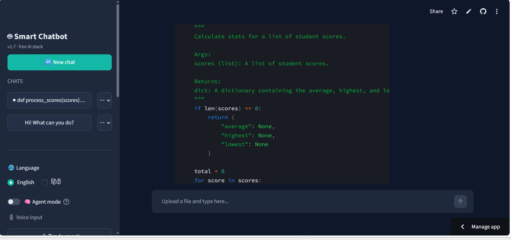
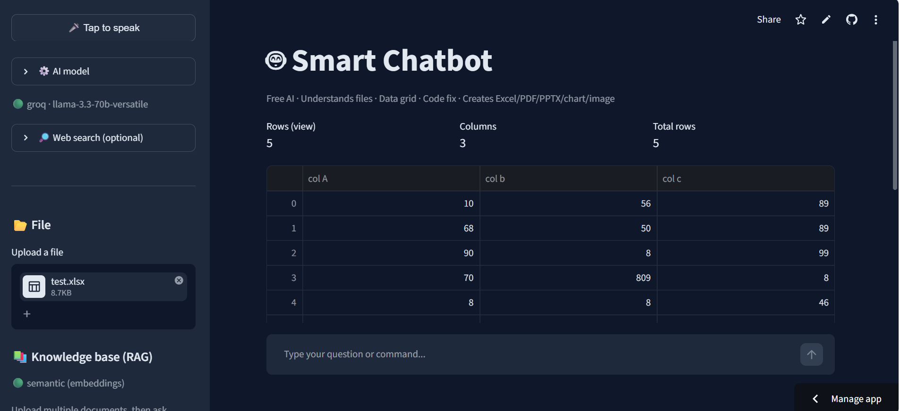
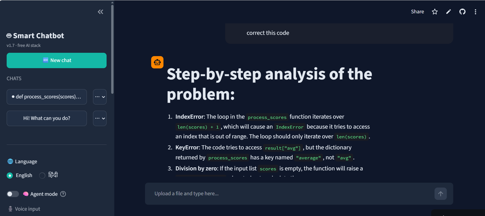
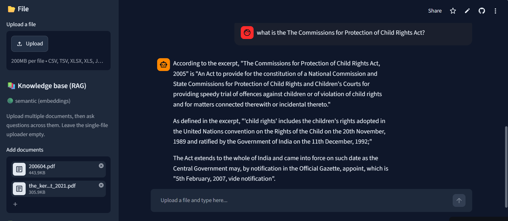

# 🤖 Smart Chatbot

**A free, offline-capable AI assistant that understands files, answers questions, fixes code, generates documents, and searches the live web — built with Python and Streamlit.**

Point it at a CSV, PDF, Python file, or a folder of documents; then just chat.

[](https://YOUR-APP-NAME.streamlit.app)

> **Status:** actively developed · Python 3.10+ · Streamlit · 100% free stack

---

## ✨ What it can do

| Category | Capability |
|---|---|
| **Files** | Upload CSV, TSV, Excel, JSON, PDF, TXT, Markdown, code files |
| **Data grid** | Sort · filter · search · add rows · add computed columns · rename/delete columns — all through chat |
| **Code assistant** | Fix errors, refactor, explain, remove unused imports · shows unified diff · undo any change |
| **File creation** | Generate Excel, PDF, PowerPoint, matplotlib charts, and AI images from prompts |
| **RAG** | Multi-document knowledge base with semantic search (sentence-transformer embeddings + ChromaDB), automatic fallback to TF-IDF if the optional deps aren't installed |
| **Live tools** | Current weather (Open-Meteo) · web search (Tavily + DuckDuckGo fallback) · date/time |
| **Conversation** | Persistent chats (survive restart), rename, delete, per-chat memory |
| **Bilingual** | Full English + Hindi support in the UI and responses |
| **Smart routing** | LLM-based intent classifier with keyword fast-path — fast on simple messages, accurate on ambiguous ones |

---

## 🖼 Screenshots

_(Add your screenshots to a `docs/` folder and update the paths below.)_

<p align="center">
  
  <br><em>Chat interface with sidebar controls</em>
</p>

<p align="center">
  
  <br><em>Interactive data grid with sort / filter / add-column via chat</em>
</p>

<p align="center">
  
  <br><em>Code fixing with unified diff and one-click undo</em>
</p>

<p align="center">
  
  <br><em>Multi-document knowledge base with source citations</em>
</p>

---

## 🚀 Quickstart

### 1. Clone and install

```bash
git clone https://github.com/YOUR_USERNAME/smart-chatbot.git
cd smart-chatbot
pip install -r requirements.txt
```

### 2. Pick an AI provider (all free)

<details>
<summary><b>Option A — Ollama (recommended: 100% local, no key, unlimited)</b></summary>

1. Install from [ollama.com](https://ollama.com)
2. Pull a model:
   ```bash
   ollama pull qwen2.5-coder
   ```
3. Ollama runs in the background automatically. Done.

</details>

<details>
<summary><b>Option B — Groq (very fast cloud, generous free tier)</b></summary>

1. Get a free API key at [console.groq.com/keys](https://console.groq.com/keys)
2. Paste it into the sidebar when the app starts, or export it:
   ```bash
   export GROQ_API_KEY="gsk_..."
   ```

</details>

<details>
<summary><b>Option C — Google Gemini (free tier)</b></summary>

1. Get a free API key at [aistudio.google.com/apikey](https://aistudio.google.com/apikey)
2. Paste it into the sidebar, or:
   ```bash
   export GEMINI_API_KEY="..."
   ```

</details>

### 3. Run

```bash
streamlit run app.py
```

The app opens at `http://localhost:8501`.

---

## 🧭 How to use it

- **Upload a file** in the sidebar to work with it directly (table grid, code panel, or text preview).
- **Upload multiple files under "Knowledge base"** to ask cross-document questions with RAG.
- **Just chat** if you don't want to upload anything — general Q&A, weather, web search, and file generation all work without a file.

### Example prompts

| Prompt | What happens |
|---|---|
| `sort by price` | Sorts the loaded table |
| `rows where city = Mumbai` | Filters rows |
| `add a column total = price * quantity` | Adds a computed column |
| `add 10 realistic records` | Appends new rows |
| `what's the average salary?` | Answers a data question |
| `fix the errors in this file` | Applies a code fix with a diff |
| `create a pie chart of sales by region` | Generates a chart PNG |
| `create a 10-slide presentation on machine learning` | Generates a `.pptx` |
| `convert these questions to a PDF with answers` | Turns the chat into a downloadable PDF |
| `create an image of a mountain sunrise` | Generates an AI image |
| `weather in Mumbai` | Live current weather |
| `latest news on ISRO` | Web search with source citations |
| `what does this document say about maternity leave?` | RAG Q&A across your uploaded docs |

---

## 🏗 Architecture

```
┌─────────────────────────────────────────────────────────────┐
│                          app.py                             │
│         (Streamlit UI · session state · routing)            │
└─────┬──────┬───────┬────────┬─────────┬─────────┬───────────┘
      │      │       │        │         │         │
      ▼      ▼       ▼        ▼         ▼         ▼
   llm.py loaders  dataops  codeops  creators   rag.py
    (LLM  (parse   (table   (fix    (Excel /   (semantic
   proxy) files)   ops)     code)   PDF /      search:
                                     PPTX /     embeddings
                                     chart /    + ChromaDB;
                                     image)    TF-IDF fallback)
                       ▲
                       │
              weather.py · websearch.py
              (live external tools)
```

**Request flow:**

1. User sends a chat message.
2. `decide_route()` uses a keyword fast-path plus an LLM intent classifier to pick a route:
   `create` · `weather` · `datetime` · `search` · `rag` · `table` · `code` · `text` · `normal`.
3. The chosen route function does its work (sometimes calling one or more tools), then produces the reply.
4. `_persist()` snapshots the active chat and writes all conversations to disk.

---

## 🧩 Tech stack

- **UI** — [Streamlit](https://streamlit.io)
- **LLMs** — Ollama (local) · Groq · Google Gemini (all free tiers)
- **Data** — pandas · openpyxl
- **Documents** — pypdf · fpdf2 · python-pptx
- **Charts** — matplotlib
- **RAG** — `sentence-transformers` embeddings + `ChromaDB` for semantic search, with a pure-Python TF-IDF fallback (`rag.py`)
- **Web search** — Tavily API (optional) with a DuckDuckGo (`ddgs`) fallback
- **Weather** — [Open-Meteo](https://open-meteo.com) (no API key required)
- **AI images** — [Pollinations.ai](https://pollinations.ai) (no API key required)

---

## 📁 Project layout

```
smart-chatbot/
├── app.py           # Streamlit UI, routing, session state
├── llm.py           # Unified LLM proxy (Ollama / Groq / Gemini)
├── loaders.py       # File-type dispatch: CSV, Excel, PDF, code, ...
├── dataops.py       # Natural-language -> pandas operations
├── codeops.py       # Code fixing with unified diff
├── creators.py      # File creation: Excel, PDF, PPTX, chart, image
├── weather.py       # Live weather via Open-Meteo
├── websearch.py     # Tavily + DuckDuckGo search
├── rag.py           # Semantic retrieval (embeddings + ChromaDB, TF-IDF fallback)
├── requirements.txt
└── README.md
```

Chats are persisted at `~/.smart_chatbot/chats.json`.

---

## 🌐 Language support

Toggle **English** or **हिंदी** in the sidebar. The switch affects:

- All UI labels, hints, and error messages
- The AI's response language

The bot understands Hindi/Hinglish input regardless of the toggle (e.g. `weather batao`, `aaj ki tareekh`, `10 records add karo`).

---

## ⚠️ Known limitations

Being transparent about what this project intentionally does **not** do (yet):

- **Excel-style formulas are not supported for computed columns.** The `add_column` action accepts only per-row arithmetic on existing columns (e.g. `total = price * quantity`, `bmi = weight / (height ** 2)`). Aggregate/lookup functions like `MAX`, `MIN`, `AVERAGE`, `SUM`, `INDEX`, `MATCH`, `VLOOKUP`, `IF`, `IFERROR`, `ROUND` etc. are explicitly rejected with a helpful message rather than silently miscomputed. For aggregate questions, ask directly in chat: *"what's the max of column A?"* or *"average salary where department = engineering"*.
- **RAG on tabular files is not ideal.** Uploading a spreadsheet as a single file (grid mode) gives the LLM the full data; putting spreadsheets into the RAG knowledge base chunks numbers apart and hurts recall. Use single-file mode for CSV/Excel questions.
- **Live web results depend on the search backend.** Tavily (with a free key) gives structured answers; the DuckDuckGo fallback (no key) sometimes returns only descriptive snippets rather than exact live numbers (scores, prices).
- **Free LLM quality varies.** With `qwen2.5-coder` (Ollama) or `llama-3.3-70b-versatile` (Groq), the LLM can occasionally hallucinate function names or make small logical mistakes. The app catches many of these (e.g. formula guard rail, single-source citations), but not all - always sanity-check important outputs.
- **Streamlit Cloud memory limit (~1 GB).** The embeddings backend (`sentence-transformers` + PyTorch) is close to that limit. If deployment OOMs, comment out `chromadb` and `sentence-transformers` in `requirements.txt` - the app transparently falls back to the pure-Python TF-IDF backend.
- **Chat and file persistence are separate.** Chats are saved to `~/.smart_chatbot/chats.json`; the KB is saved in `~/.smart_chatbot/chroma/`; but a single uploaded working file (grid mode) is session-only by design (re-upload after restart).
- **No authentication.** If deployed publicly, anyone can use the app with your provider keys (if configured in Streamlit secrets). Set per-user limits or require BYO-key in production.

---

## 🗺 Roadmap

- [x] Multi-provider free LLM support
- [x] Interactive data grid with chat-driven operations
- [x] File creation: Excel, PDF, PPTX, chart, image
- [x] Bilingual UI + input understanding
- [x] Persistent conversation history
- [x] Multi-document RAG
- [x] Live weather, web search, date/time
- [x] LLM-based intent routing
- [x] Agent mode (multi-step tool chaining)
- [x] Embeddings + ChromaDB for semantic RAG (with TF-IDF fallback)
- [x] Streamlit Community Cloud deployment
- [ ] Vision (image understanding)
- [ ] Voice input

---

## 🤝 Contributing

Issues and PRs welcome. Please keep the "everything free, no vendor lock-in" spirit — new features should work with at least one free backend.

---

## 📄 License

MIT
